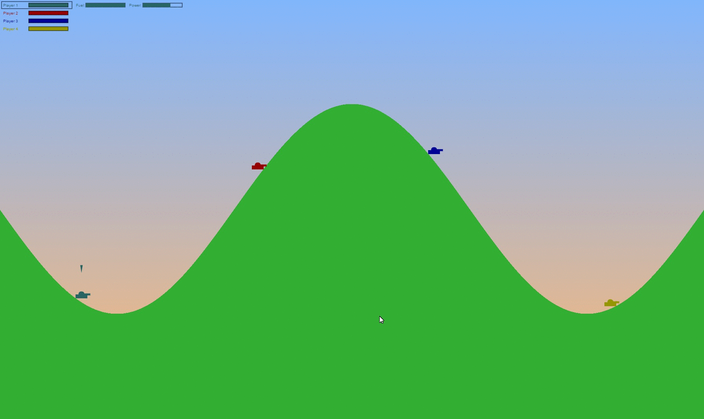

# Tanks
[Play it Live Now](https://lehmniscate.github.io/tanks)
## Background
Tanks is a turn based game where a player faces off against other players or computer players. They are allowed to move a certain distance and aim and make a shot each turn. Terrain is destroyed with the shots as well as damage to the player if the player gets hit. Destroyed terrain under a tank will cause the tank to fall. Changes in terrain also provide varying obstacles for movement and aiming.

Tanks is a solo project by Michael Hooton.



## Technologies

Tanks uses JavaScript and HTML5's canvas features to draw an interactive game.

## Terrain Destruction

By saving the terrain as its image data that is painted as-is to the screen, painting the background onto the terrain effectively destroys that part of the terrain. Collision detection is handled by asking the tanks or the bullets for their hitbox area, and polling the terrain's pixel data for that area and checking the color.

```
explosion(x, y, r) {
  this.ctx.globalCompositeOperation = "destination-out";
  this.ctx.beginPath();
  this.ctx.arc(x, y, r, 0, Math.PI * 2, true);
  this.ctx.fillStyle = this.backgroundColor;
  this.ctx.fill();
  this.ctx.closePath();

  //update
  let {tx, ty, width, height} = this.terrain_bitmap;
  var newCanvasData = this.ctx.getImageData(tx, ty, width, height);
  this.terrain_bitmap.imageData = newCanvasData;
  this.ctx.putImageData(newCanvasData, tx, ty);
}
```
